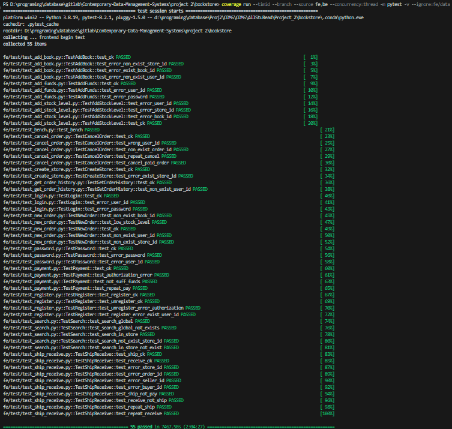

# Project2

## Agenda :calendar:
  
|  Task  |  Date  | remark | tag |
|  :-----: | :------: | :-----:| :-----:|
|  move the code from proj1 to proj2,modify code from MongoDb to postgreSQL |2024/5/24  | initiate the code&data for the proj2 | - |
|  confirm the code with 60% basic function correct, run the test and passed |2024/5/29 | confirm code for proj2 | v2.0 |

## 5-24

Work:Create the repository,and modifying the v1.0 code,no code upload

## 5-29

Work:confirm the code and run the test

