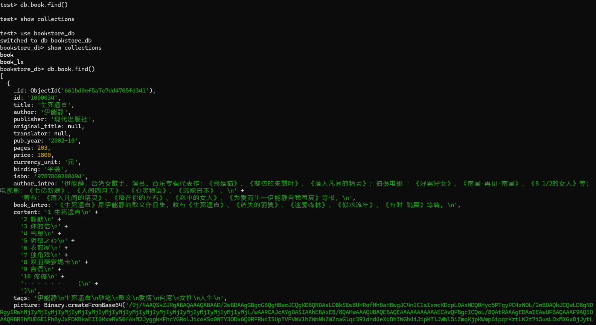
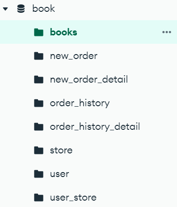
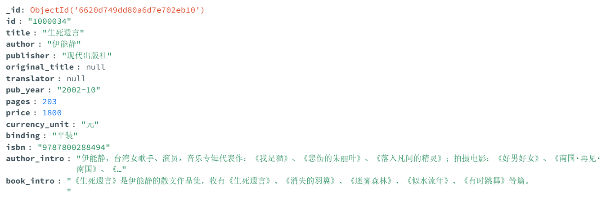

# CDMS

## Agenda :calendar:
  
|  Task  |  Date  | remark |
|  :-----: | :------: | :-----:|
|  down load data into [book.db](https://github.com/kevinyao0901/CDMS/blob/main/AllStuRead/Project_1/bookstore/fe/data/book.db) & write [script](https://github.com/kevinyao0901/CDMS/blob/main/AllStuRead/Project_1/bookstore/script/uoload_data.py) to upload data into local database|2024/4/14  | initiate the code&data for the proj |
|  build basic struture unit for the database using script [initiate_database.py](https://github.com/kevinyao0901/CDMS/blob/main/AllStuRead/Project_1/bookstore/fe/script/initiate_database.py) & rewrite [script](https://github.com/kevinyao0901/CDMS/blob/main/AllStuRead/Project_1/bookstore/script/uoload_data.py) to upload data into the structure |2024/4/18  | construct stucture for the database |

## 4-14

Work:Initiate the code for the proj,try to download data from BaiduNetDisk,and write script to upload data to local database.

temporary results:

## 4-18

Work:Build up basic struture unit for the database,and upload data into the structure

temporary results:

